```{r setup, include=FALSE}
knitr::opts_chunk$set(echo = TRUE, comment=NA, warning = FALSE, message = FALSE, fig.align = "center", fig.retina = 5, fig.height = 5, fig.width = 5)
```

# Introduction
Exploratory Data Analysis refers to the critical process of performing initial investigations on data so as to discover patterns,to spot anomalies,to test hypothesis and to check assumptions with the help of summary statistics and graphical representations.


Exploratory data analysis (EDA) methods are often called Descriptive Statistics due to the fact that they simply describe, or provide estimates based on, the data at hand.

## Exploratory Data Analysis 

> “Exploratory data analysis can never be the whole story, but nothing else can serve as the foundation stone.” —John Tukey

EDA consists of:

- Organizing and summarizing the raw data,
- Discovering important features and patterns in the data and any striking deviations from 
those patterns 
- Interpreting our findings in the context of the problem

And can be useful for:

- Describing the distribution of a single variable (center, spread, shape, outliers)
- Checking data (for errors or other problems)
- Checking assumptions to more complex statistical analyses
- Investigating relationships between variables


## Features of Exploratory Data Analysis
- In this notebook covers two broad topics:
  - Examining Distributions — exploring data one variable at a time.
  - Examining Relationships — exploring data two variables at a time.


- In Exploratory Data Analysis, our exploration of data will always consist of the following two elements:
  - Visual displays 
  - Numerical measures.
  


# Working with Data using R 
In this lesson, we will explore pulse dataset using R. In addition, we will perform exploratory data analysis. 

## Load Packages 
```{r, packages}
# Load packages 
library(tidyverse)
library(ggplot2)
library(ggpubr)
library(gridExtra)
library(gtsummary)
library(gt)
library(datasets)
```


## Load and Explore Data 
```{r, data}
# Read Data 
data <- read.csv("data/pulse_data.csv", stringsAsFactors = TRUE)
gt(head(data)) 
```

```{r, data-structure}
# Check data structure 
glimpse(data)
```

# One Categorical Variable
- Distribution of One Categorical Variable
- Numerical Summaries
  - One-way Frequency Table(Counts)
  - One-way Frequency Table(Percentages)
  - One-way Frequency Table(Combination of Counts and Percentages)
- Visual or Graphical Displays
  - Bar Chart - Great for categorical data visualization
  - Pie Chart - Use with caution for summarizing categorical data 


## Distribution of One Categorical Variable
Here is some information that would be interesting to get from these data:

- What percentage of the sampled respondents fall into each category?
- How are respondents divided across the three body image categories? Are they equally divided? If not, do the percentages follow some other kind of pattern?


## Numerical Measures
In order to summarize the distribution of a categorical variable, we first create a table of the different values (categories) the variable takes, how many times each value occurs (count) and, more importantly, how often each value occurs (by converting the counts to percentages).

- The result is often called a Frequency Distribution or Frequency Table.
- A Frequency Distribution or Frequency Table is the primary set of numerical measures for one categorical variable.
- Consists of a table with each category along with the count and percentage for each category.
- Provides a summary of the distribution for one categorical variable.


### One-way Frequency Table(Counts)
```{r}
# One-way frequency table 
data %>% 
  group_by(BMICat) %>% 
  summarise(frequency = n())
```

### One-way Frequency Table(Counts, Percentage)

```{r}
data %>% 
  group_by(BMICat) %>% 
  summarise(counts = n()) %>% 
  mutate(percent = counts/sum(counts) *100) 
```


## Visual or Graphical Displays
There are two simple graphical displays for visualizing the distribution of one categorical variable:

- Bar Charts
- Pie Charts

### Bar Charts
- To describe the number of observations in each category of the discrete variable
- To visualize estimated error for discrete variables


```{r}
# Visualize one categorical variable; `fct_infreq()` for sorting the bar 
data %>% 
  ggplot(aes(x = BMICat))+
  geom_bar(fill = "#97B3C6")
```


```{r}
# # Sorting Bar Chart by using `fct_infreq()`
data %>% 
  ggplot(aes(x = fct_infreq(BMICat)))+
  geom_bar(fill = "#97B3C6")
```
```{r}
# Summaries(counts) data for visualizing the distribution 
df1 <- data %>% 
  group_by(BMICat) %>% 
  summarise(counts = n()) %>% 
  arrange(counts)

df1
```

```{r}
# Show the observations number on the top the bar 
ggplot(df1, aes(x = BMICat, y = counts)) +
  geom_bar(fill = "#97B3C6", stat = "identity") +
  geom_text(aes(label = counts), vjust = -0.3)
```

```{r}
# # Sorting bar by using `reorder()`
ggplot(df1, aes(x = reorder(BMICat, counts), y = counts)) +
  geom_bar(fill = "#97B3C6", stat = "identity") +
  geom_text(aes(label = counts), vjust = -0.3)
```


```{r}
# # Sorting bar by using `reorder()` and `desc()`
ggplot(df1, aes(x = reorder(BMICat, desc(counts)), y = counts)) +
  geom_bar(fill = "#97B3C6", stat = "identity") +
  geom_text(aes(label = counts), vjust = -0.3)
```


```{r}
# Calculate percentage of each category 
df2 <- data %>% 
  group_by(BMICat) %>% 
  summarise(counts = n()) %>% 
  arrange(desc(BMICat)) %>% 
  mutate(prop = round(counts*100/sum(counts), 1))
df2
```

```{r}
# Sorting the bars using `reorder()`
ggplot(df2, aes(x = reorder(BMICat, counts), y = prop)) +
  geom_bar(fill = "#97B3C6", stat = "identity") +
  geom_text(aes(label = prop), vjust = -0.3)
```


```{r}
# Show the percentage(%) on the of the bar 
ggplot(df2, aes(x = BMICat, y = prop)) +
  geom_bar(fill = "#97B3C6", stat = "identity") +
  geom_text(aes(label = prop), vjust = -0.3)
```
```{r}
# Sorting the bars using `reorder()` and  `desc()`
ggplot(df2, aes(x = reorder(BMICat, desc(prop)), y = prop)) +
  geom_bar(fill = "#97B3C6", stat = "identity") +
  geom_text(aes(label = prop), vjust = -0.3)
```
```{r}
# Customize the plot
ggplot(df2, aes(x = reorder(BMICat, desc(counts)), y = prop)) +
  geom_bar(fill = "#97B3C6", stat = "identity") +
  geom_text(aes(label = prop), vjust = -0.3)+
  labs(title = "Distribution of BMICat", 
       x = "BMI Category", 
       y = "Proportion", 
       caption = "Data Source: https://bolt.mph.ufl.edu/") 
```

```{r}
# Create bar chart using ggpubr 
ggbarplot(df2, x = "BMICat", y = "counts", fill = "#97B3C6")
```


```{r}
# show counts 
ggbarplot(df2, x = "BMICat", y = "counts", fill = "#97B3C6", label = TRUE, lab.pos = "out")
```
```{r}
# show counts 
ggbarplot(df2, x = "BMICat", y = "prop", fill = "#97B3C6", label = TRUE, lab.pos = "out")
```


### Pie charts
```{r}
ggpie(df2, "prop", label = "BMICat", fill = "BMICat", 
      color = "white", 
      palette = c("#00AFBB", "#E7B800", "#FC4E07", "#97B3C6"))
```

```{r}
# Show group names and value as labels
labs <- paste0(df2$BMICat, " (", df2$prop, "%)")

ggpie(df2, "prop", label =labs, fill = "BMICat", 
      color = "white", 
      palette = c("#00AFBB", "#E7B800", "#FC4E07", "#97B3C6"), lab.pos = "in")
```


```{r}
# Change the position and font color of labels
labs <- paste0(df2$BMICat, "(", df2$prop, "%)")

ggpie(df2, "prop", label =labs, 
      lab.pos = "in", lab.font = "white",
      fill = "BMICat", 
      color = "white", 
      palette = c("#00AFBB", "#E7B800", "#FC4E07", "#97B3C6"))
```


# One Quantitative Variable
- Distribution of One Quantitative Variable
- Numerical Measures
- Graphs

## Distribution of One Quantitative Variable

In this section, we will explore the data collected from a quantitative variable, and learn how to describe and summarize the important features of its distribution.

We will learn how to display the distribution using graphs and discuss a variety of numerical measures.


## Numerical Measures

### Measures of Center
- Introduction
- Mean
- Median
- Comparing the Mean and the Median


#### Mean
```{r}
# Average BMI
data %>% 
  summarise(avg_bmi = mean(BMI))
```
#### Median

```{r}
# Median BMI
data %>% 
  summarise(median_bmi = median(BMI))
```

## Graphs

### Histograms
- Shape: Overall appearance of histogram. Can be symmetric, bell-shaped, left skewed, right skewed, etc.

- Center: Mean or Median

- Spread: How far our data spreads. Range, Interquartile Range (IQR),standard deviation, variance.

- Outliers: Data points that fall far from the bulk of the data


```{r, echo=FALSE}
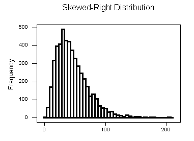
```


```{r, echo=FALSE}
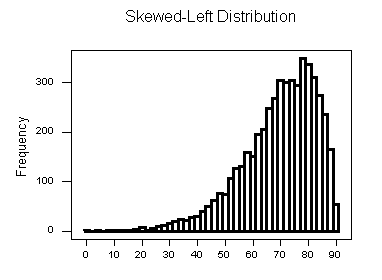
```


```{r, echo=FALSE}
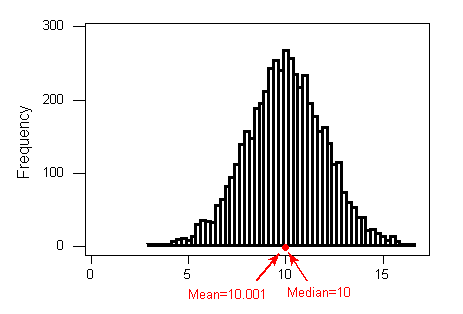
```
**Interpretation:**  The distribution of height is  bell
shaped with a center of about 10.001, a range of 11 inches (5 to 16), and no apparent outliers.


```{r}
# Calculate average height 
data %>% 
  summarise(avg_height = mean(Height))
```
```{r}
# Show the center in histogram 
gghistogram(data, x = "Height", add = "mean")
```

```{r, echo=FALSE}
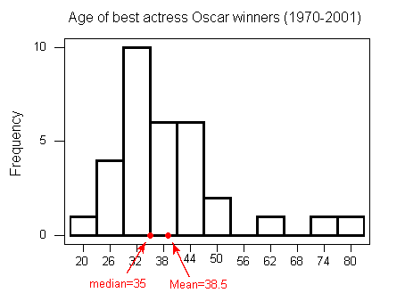
```


```{r}
# Calculate median height 
data %>% 
  summarise(median_height = median(Height))
```

```{r}
# Show the center in histogram 
gghistogram(data, x = "Height", add = "median")
```


```{r}
# Add mean  
gghistogram(data, x = "Height", bins = 15, fill = "#97B3C6", title = "Histogram of Height", xlab = "Height(m)", ylab = "Frequency", add = "mean")
```
**Interpretation:**  The distribution of height is roughly bell
shaped with a center of about 1.7m, a range of 0.55 meters (1.40 to 1.95), and no apparent outliers.


```{r}
# Change the bins size 
gghistogram(data, x = "Height", bins = 15, fill = "#58508d" , add = "mean")
```


```{r}
# Compare mean and median 
data %>% 
  summarise(avg_bmi = mean(BMI), 
            median_bmi = median(BMI))
```


## Describing Distributions
- Features of Distributions of Quantitative Variables
- Shape (Symmetry/Skewness, Modality)
- Center
- Spread
- Outliers


```{r}
# Load and explore diabetes data 
diabetes <- read.csv("data/diabetes.csv", stringsAsFactors = TRUE)
gt(head(diabetes))
```


### Shape
When describing the shape of a distribution, we should consider:

- Symmetry/skewness of the distribution.
- Peakedness (modality) — the number of peaks (modes) the distribution has.

### Symmetric Distributions
```{r, echo=FALSE}
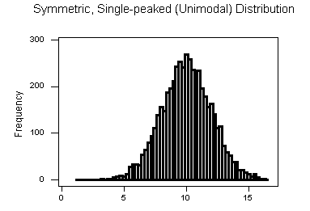
```


```{r, echo=FALSE}
knitr::include_graphics("img/images-mod1-histogram3.gif")
```

```{r, echo=FALSE}
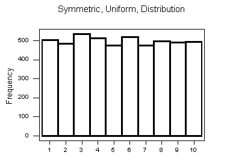
```
Note that all three distributions are symmetric, but are different in their modality (peakedness).

- The first distribution is unimodal — it has one mode (roughly at 10) around which the observations are concentrated.
- The second distribution is bimodal — it has two modes (roughly at 10 and 20) around which the observations are concentrated.
- The third distribution is kind of flat, or uniform. The distribution has no modes, or no value around which the observations are concentrated. Rather, we see that the observations are roughly uniformly distributed among the different values.
```{r}
# Check distribution of age 
gghistogram(diabetes, x = "BMI", fill = "#665191")
```


### Skewed Right Distributions
A distribution is called skewed right if, as in the histogram above, the right tail (larger values) is much longer than the left tail (small values).
```{r, echo=FALSE}

```


```{r}
# Check distribution of age 
gghistogram(diabetes, x = "Age", fill = "#665191")
```

### Skewed Left Distributions
A distribution is called skewed left if, as in the histogram above, the left tail (smaller values) is much longer than the right tail (larger values).

```{r, echo=FALSE}

```


```{r}
# Check distribution of Glucose 
gghistogram(diabetes, x = "Glucose", fill = "#665191")
```

Comments:
- Distributions with more than two peaks are generally called multimodal.
- Bimodal or multimodal distributions can be evidence that two distinct groups are represented.
- Unimodal, Bimodal, and multimodal distributions may or may not be symmetric.


```{r, echo=FALSE}
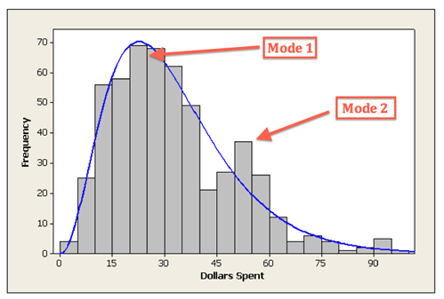
```

### Center
The center of the distribution is often used to represent a typical value.

```{r}
# Check distribution of BMI 
gghistogram(diabetes, x = "BMI", fill = "#665191", add = "mean", add_density = TRUE)
```

```{r}
# Check distribution of BMI 
gghistogram(diabetes, x = "BMI", fill = "#665191", add = "median")
```


### Spread
One way to measure the spread (also called variability or variation) of the distribution is to use the approximate range covered by the data.
```{r}
# Check distribution of BloodPressure 
gghistogram(diabetes, x = "BloodPressure", fill = "#665191", add = "median")
```

### Outliers
Outliers are observations that fall outside the overall pattern.

```{r, echo=FALSE}
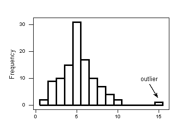
```

```{r}
# Check distribution of BloodPressure 
gghistogram(diabetes, x = "BloodPressure", fill = "#665191", add = "median")
```


## Measures of Spread
- Range
- Inter-Quartile Range (IQR)
- Standard Deviation
- Properties of the Standard Deviation
- Choosing Numerical Measures


### Range
The range covered by the data is the most intuitive measure of variability. The range is exactly the distance between the smallest data point (min) and the largest one (Max).

Range = Max – min

```{r}
data %>% 
  summarise(max_height = max(Height), 
            min_height = min(Height), 
            range = max_height - min_height)
```

### Inter-Quartile Range (IQR)
While the range quantifies the variability by looking at the range covered by ALL the data, the Inter-Quartile Range or IQR measures the variability of a distribution by giving us the range covered by the MIDDLE 50% of the data.

- IQR = Q3 – Q1
- Q3 = 3rd Quartile = 75th Percentile
- Q1 = 1st Quartile = 25th Percentile

```{r}
data %>% 
  summarise(
            min = fivenum(Weight)[1],
            Q1 = fivenum(Weight)[2],
            median = fivenum(Weight)[3],
            Q3 = fivenum(Weight)[4],
            max = fivenum(Weight)[5], 
            IQR = Q3 - Q1)
```

### Standard Deviation
```{r}
data %>% 
  summarise(avg_height = mean(Height), 
            std = sd(Height)) 
     
```


### Variance 
```{r}
data %>% 
  summarise(avg_height = mean(Height), 
            var_height = var(Height)) 
```


## Measures of Position
- Percentiles
- Five-Number Summary
- Standardized Scores (Z-Scores)
- Measures of Position

### Percentiles
In general the P-th percentile can be interpreted as a location in the data for which approximately P% of the other values in the distribution fall below the P-th percentile and (100 –P)% fall above the P-th percentile.


### Five Number Summary 
```{r}
data %>% 
  summarise(
            min = fivenum(Weight)[1],
            Q1 = fivenum(Weight)[2],
            median = fivenum(Weight)[3],
            Q3 = fivenum(Weight)[4],
            max = fivenum(Weight)[5])
```


### Standardized Scores (Z-Scores)

Z = (x – mean)/standard deviation
```{r}
data %>% 
  mutate(zscore = (BMI - mean(BMI) / sd(BMI))) %>% 
  head() 
```


### Measures of Position

Measures of position also allow us to compare values from different distributions. For example, we can present the percentiles or z-scores of an individual’s height and weight. These two measures together would provide a better picture of how the individual fits in the overall population than either would alone.

Although measures of position are not stressed in this course as much as measures of center and spread, we have seen and will see many measures of position used in various aspects of examining the distribution of one variable and it is good to recognize them as measures of position when they appear.


## Outliers Detection 
- Using the IQR to Detect Outliers
- The 1.5(IQR) Criterion for Outliers
- The 3(IQR) Criterion for Outliers
- Understanding Outliers


### Using the IQR to Detect Outliers
So far we have quantified the idea of center, and we are in the middle of the discussion about measuring spread, but we haven’t really talked about a method or rule that will help us classify extreme observations as outliers. The IQR is commonly used as the basis for a rule of thumb for identifying outliers.

### The 1.5(IQR) Criterion for Outliers
An observation is considered a suspected outlier or potential outlier if it is:

- below Q1 – 1.5(IQR) or
- above Q3 + 1.5(IQR)

The following picture (not to scale) illustrates this rule:

```{r, echo=FALSE}
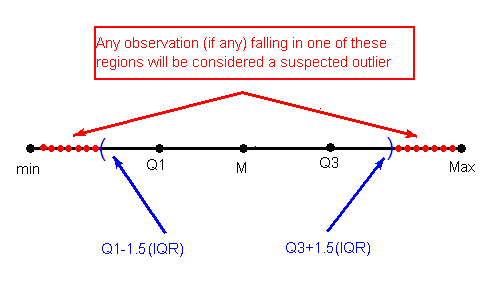
```

```{r, echo=FALSE}
knitr::include_graphics("img/images-mod1-spread11.gif")
```

### The 3(IQR) Criterion for Outliers

An observation is considered an EXTREME outlier if it is:

- below Q1 – 3(IQR) or
- above Q3 + 3(IQR)

```{r, echo=FALSE}
knitr::include_graphics("img/images-mod1-spread11.gif")
```
```{r}
ds <- read.csv("data/500_Person_Gender_Height_Weight_Index.csv")
head(ds)
```


```{r}
gghistogram(ds, x = "Height")
```

```{r}
gghistogram(ds, x = "Weight")
```


## Boxplots
- The Five Number Summary
- The Boxplot
- Side-By-Side (Comparative) Boxplots


### The Five Number Summary
So far, in our discussion about measures of spread, some key players were:

- the extremes (min and Max), which provide the range covered by all the data; and
- the quartiles (Q1, M and Q3), which together provide the IQR, the range covered by the middle 50% of the data.

Recall that the combination of all five numbers (min, Q1, M, Q3, Max) is called the five number summary, and provides a quick numerical description of both the center and spread of a distribution.

```{r}
ds %>% 
  summarise(
            min = fivenum(Height)[1],
            Q1 = fivenum(Height)[2],
            median = fivenum(Height)[3],
            Q3 = fivenum(Height)[4],
            max = fivenum(Height)[5])
```

### The Boxplot
1. The central box spans from Q1 to Q3. In our example, the box spans from 32 to 41.5. Note that the width of the box has no meaning.
```{r echo=FALSE}
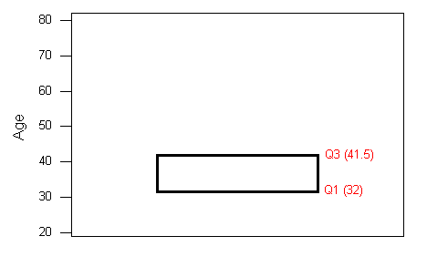
```
2. A line in the box marks the median M, which in our case is 35.

```{r echo=FALSE}
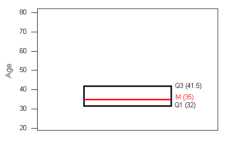
```

3. Lines extend from the edges of the box to the smallest and largest observations that were not classified as suspected outliers (using the 1.5xIQR criterion). In our example, we have no low outliers, so the bottom line goes down to the smallest observation, which is 21. Since we have three high outliers (61,74, and 80), the top line extends only up to 49, which is the largest observation that has not been flagged as an outlier.

```{r echo=FALSE}
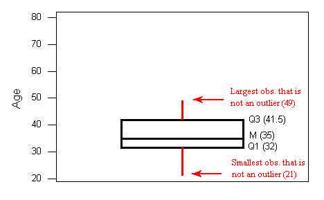
```
4. outliers are marked with asterisks (*).
```{r echo=FALSE}
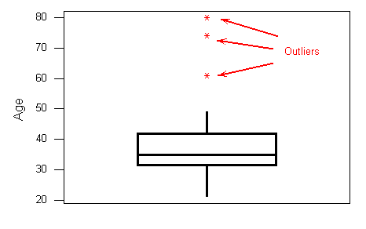
```
To summarize: the following information is visually depicted in the boxplot:

the five number summary (blue)
the range and IQR (red)
outliers (green)

```{r echo=FALSE}
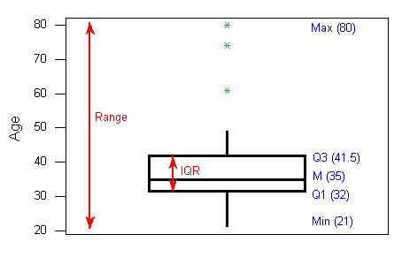
```

### Side-By-Side (Comparative) Boxplots
```{r echo=FALSE}
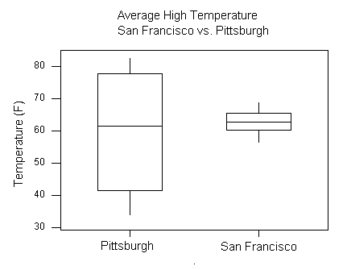
```


```{r}
ggboxplot(ds, y = "Height")
```


```{r}
ggboxplot(ds, y = "Weight")
```


```{r}
ggboxplot(ds, x = "Gender", y = "Height")
```


## The “Normal” Shape
- The Standard Deviation Rule
- Visual Methods of Assessing Normality
- Standardized Scores (Z-Scores)

### The Standard Deviation Rule

```{r echo=FALSE}
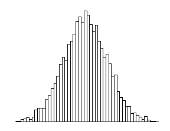
```


### The Standard Deviation Rule:

- Approximately 68% of the observations fall within 1 standard deviation of the mean.
- Approximately 95% of the observations fall within 2 standard deviations of the mean.
- Approximately 99.7% (or virtually all) of the observations fall within 3 standard deviations of the mean.
```{r echo=FALSE}
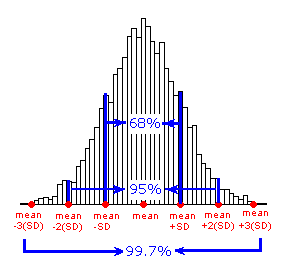
```

```{r echo=FALSE}
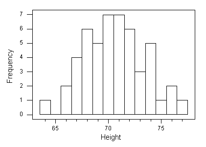
```
```{r echo=FALSE}
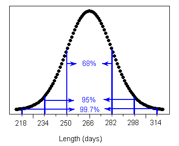
```

```{r echo=FALSE}
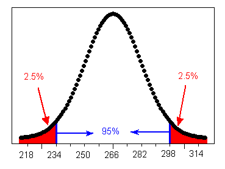
```


```{r echo=FALSE}
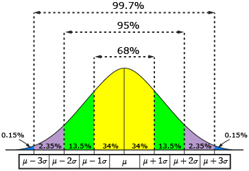
```


### Visual Methods of Assessing Normality
```{r echo=FALSE}
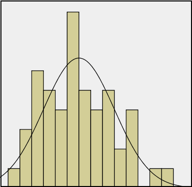
```

```{r echo=FALSE}
knitr::include_graphics("img/images-mod1-360px-Normal-normal-qq.svg_.png")
```

```{r echo=FALSE}
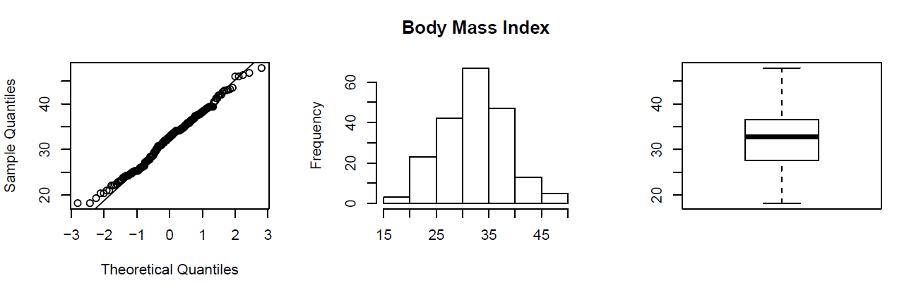
```
```{r echo=FALSE}
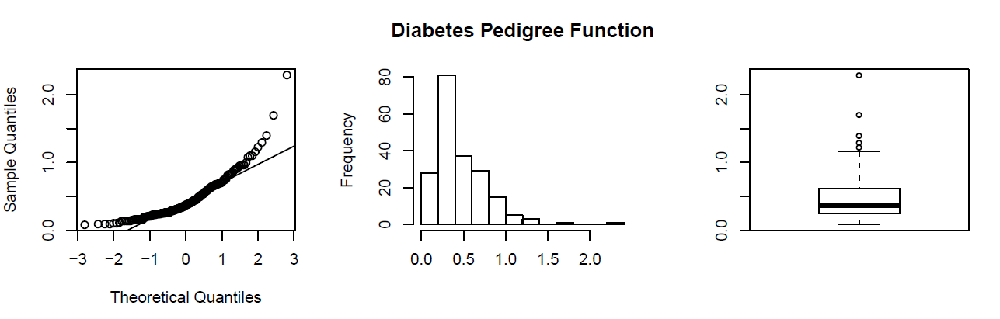
```

### Standardized Scores (Z-Scores)
Z = (x - mean) / standard deviation 
```{r}
ds %>% 
  mutate(zscore = (Height - mean(Height)) / sd(Height)) %>% 
  head() 
```


# Role Type Classification 
While it is fundamentally important to know how to describe the distribution of a single variable, most studies pose research questions that involve exploring the relationship between two (or more) variables. These research questions are investigated using a sample from the population of interest.


## Example Research Question(s)
1. Is there a relationship between gender and test scores on a particular standardized test? Other ways of phrasing the same research question:
  - Is performance on the test related to gender?
  - Is there a gender effect on test scores?
  - Are there differences in test scores between males and females?
  
2. Are the smoking habits of a person (yes, no) related to the person’s gender(male, female)?


## Role of a Variable in a Study
In most studies involving two variables, each of the variables has a role. We distinguish between:

- Response variable — the outcome of the study; and
- Eexplanatory variable — the variable that claims to explain, predict or affect the response.

As we mentioned earlier the variable we wish to predict is commonly called the dependent variable, the outcome variable, or the response variable. Any variable we are using to predict (or explain differences) in the outcome is commonly called an explanatory variable, an independent variable, a predictor variable, or a covariate.


Typically the explanatory variable is denoted by X, and the response variable by Y.


### Example 
1. Research Question: Is there a relationship between gender and test scores on a particular standardized test? Other ways of phrasing the same research question:
  - Is performance on the test related to gender?
  - Is there a gender effect on test scores?
  - Are there differences in test scores between males and females?

- Gender is the explanatory variable

- Test score is the response variable

## Role-Type Classification
If we further classify each of the two relevant variables according to type (categorical or quantitative), we get the following 4 possibilities for “role-type classification”

- Categorical explanatory and quantitative response (Case CQ)
- Categorical explanatory and categorical response (Case CC)
- Quantitative explanatory and quantitative response (Case QQ)
- Quantitative explanatory and categorical response (Case QC)

```{r echo=FALSE, fig.cap="Figure Caption"}
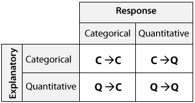
```


### Example 
1. Research Question: Is there a relationship between gender and test scores on a particular standardized test? Other ways of phrasing the same research question:
  - Is performance on the test related to gender?
  - Is there a gender effect on test scores?
  - Are there differences in test scores between males and females?

- Gender is the explanatory variable

- Test score is the response variable

- Therefore this is an example of case C → Q.


## Case C-Q Categorical Explanatory and Quantitative Response

```{r}
data %>% 
  select(Gender, BMI) %>% 
  group_by(Gender) %>% 
  summarise(Avg_BMI = mean(BMI))
```

```{r}
data %>% 
  group_by(Gender) %>% 
  summarise(n = n(),
            min = fivenum(BMI)[1],
            Q1 = fivenum(BMI)[2],
            median = fivenum(BMI)[3],
            Q3 = fivenum(BMI)[4],
            max = fivenum(BMI)[5])
```


```{r}
ggboxplot(data, x = "Gender", y = "BMI")
```

## Case C-C - Two Categorical Variables

```{r}
# https://www.statology.org/dplyr-crosstab/
df3 <- data %>% 
  group_by(Gender, Ran) %>% 
  tally() %>% 
  spread(Ran, n)
df3 
```

```{r}
# https://www.statology.org/dplyr-crosstab/
df3 <- data %>% 
  group_by(Gender, BMICat) %>% 
  tally() %>% 
  spread(BMICat, n)

df3
```


## Case Q-Q - Two Quantitative Variables
```{r}
data %>% 
  select(Height, Weight) %>% 
  cor()
```

### Scatterplots

- Creating Scatterplots
- Interpreting Scatterplots
- Direction
- Form
- Strength

### Interpreting Scatterplots

```{r echo=FALSE, fig.cap="Figure Caption"}
knitr::include_graphics("img/images-mod2-scatterplot5.gif")
```


### Direction
```{r echo=FALSE, fig.cap="Figure Caption"}
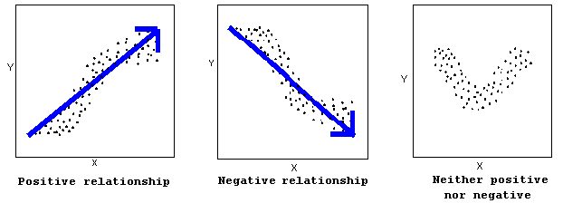
```
A positive (or increasing) relationship means that an increase in one of the variables is associated with an increase in the other.

A negative (or decreasing) relationship means that an increase in one of the variables is associated with a decrease in the other.

Not all relationships can be classified as either positive or negative.


### Form
```{r echo=FALSE, fig.cap="Figure Caption"}
knitr::include_graphics("img/images-mod2-scatterplot9.gif")
```
The form of the relationship is its general shape. When identifying the form, we try to find the simplest way to describe the shape of the scatterplot. There are many possible forms. Here are a couple that are quite common:
Relationships with a linear form are most simply described as points scattered about a line:

```{r echo=FALSE, fig.cap="Figure Caption"}
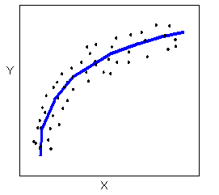
```
A scatterplot in which the points are slightly above or below a line which has been drawn through the points. Overall, the points create a shape that appears to be a fat line. In this example, the points create a negative relationship.Relationships with a non-linear (sometimes called curvilinear) form are most simply described as points dispersed around the same curved line:


```{r echo=FALSE, fig.cap="Figure Caption"}
knitr::include_graphics("img/images-mod2-scatterplot11.gif")
```
There are many other possible forms for the relationship between two quantitative variables, but linear and curvilinear forms are quite common and easy to identify. Another form-related pattern that we should be aware of is clusters in the data:


### Strength
```{r echo=FALSE, fig.cap="Figure Caption"}
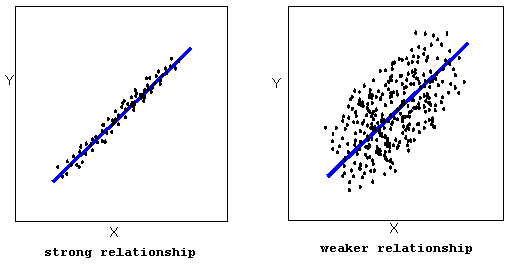
```
The strength of the relationship is determined by how closely the data follow the form of the relationship. Let’s look, for example, at the following two scatterplots displaying positive, linear relationships:


The strength of the relationship is determined by how closely the data points follow the form. We can see that in the left scatterplot the data points follow the linear pattern quite closely. This is an example of a strong relationship. In the right scatterplot, the points also follow the linear pattern, but much less closely, and therefore we can say that the relationship is weaker. In general, though, assessing the strength of a relationship just by looking at the scatterplot is quite problematic, and we need a numerical measure to help us with that. We will discuss that later in this section.


```{r echo=FALSE, fig.cap="Figure Caption"}
knitr::include_graphics("img/images-mod2-scatterplot14.gif")
```
Data points that deviate from the pattern of the relationship are called outliers. We will see several examples of outliers during this section. Two outliers are illustrated in the scatterplot below:


```{r echo=FALSE, fig.cap="Figure Caption"}
knitr::include_graphics("img/images-mod2-scatterplot11.gif")
```

```{r}
ggscatter(data, x = "Height", y = "Weight", shape = 21, size = 3,  add = "reg.line", fill = "lightgray",  color = "Gender")
```


