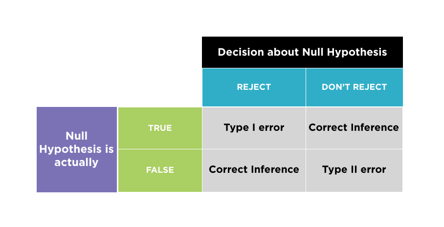
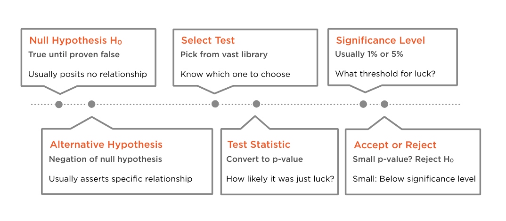
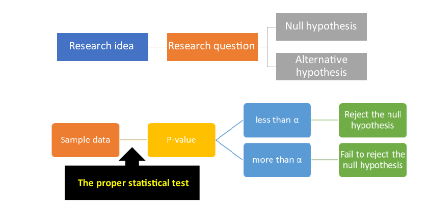
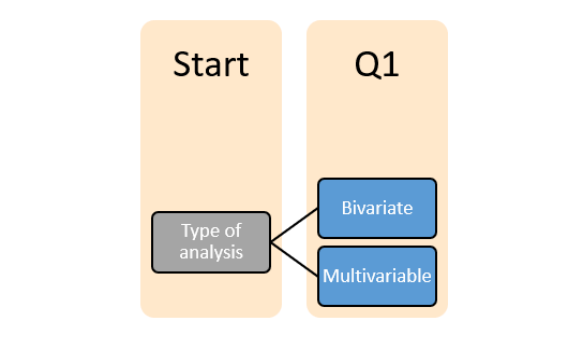
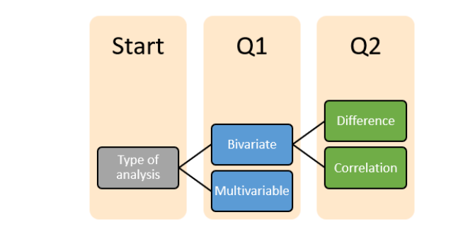
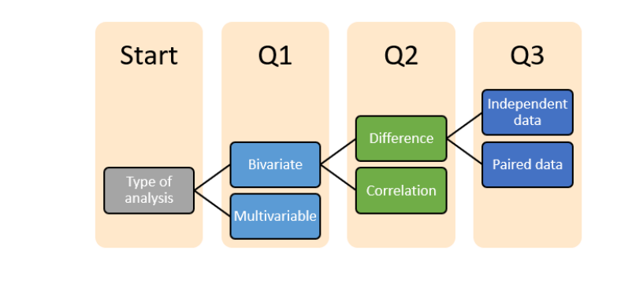
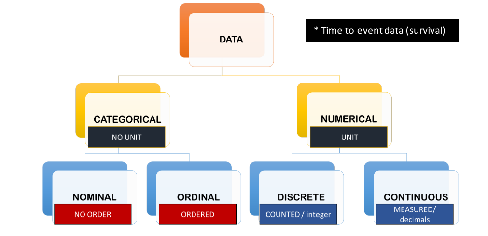
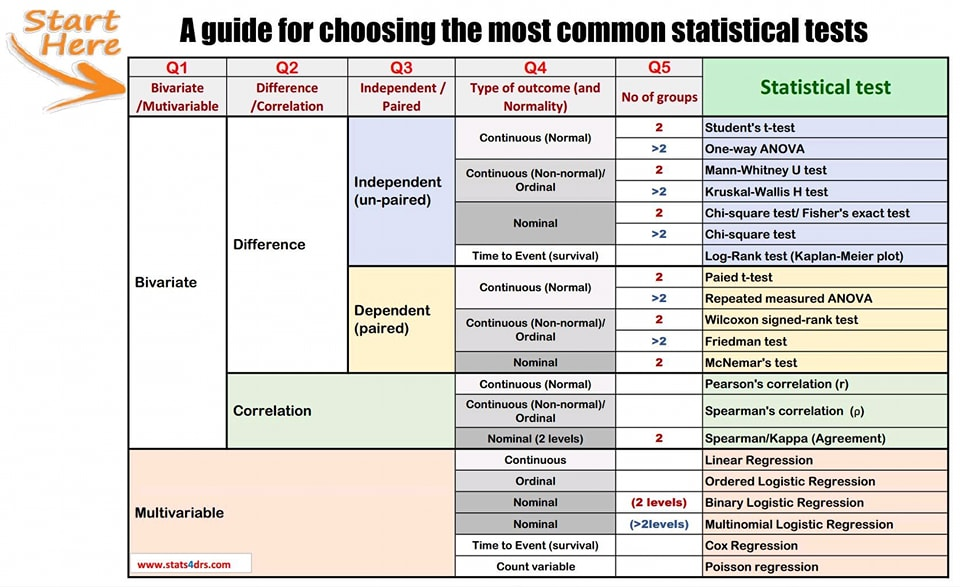
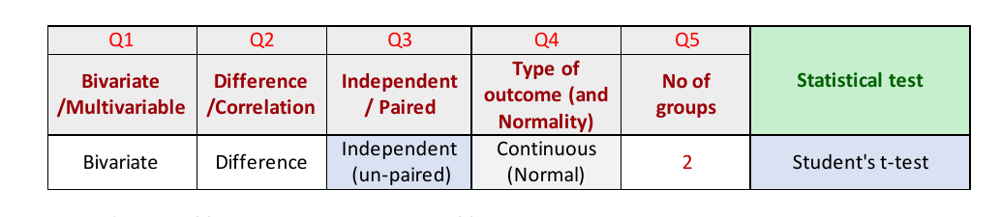

```{r setup, include=FALSE}
knitr::opts_chunk$set(echo = TRUE, comment=NA, warning = FALSE, message = FALSE, fig.align = "center", fig.retina = 5, fig.height = 5, fig.width = 5)
```

# Introduction to Inferential Statistics

Assess the strength of evidence for/against a hypothesis; evaluate the data

* Inferential statistical methods provide a confirmatory data analysis.
  - Generalize conclusions from data from part of a group (sample) to the whole group
(population)
  - Assess the strength of the evidence
  - Make comparisons
  - Make predictions
  
Inferential statistical methods divide into 2 categories.

* **Hypothesis Testing**: Hypothesis testing is a formal procedure for investigating our ideas
about the world using statistics. It is most often used by scientists to test specific
predictions, called hypotheses, that arise from theories.

* **Model Fitting**: Model fitting is a measure of how well a statistical learning model
generalizes to similar data to that on which it was trained. A model that is well-fitted
produces more accurate outcomes.

## What is Inference?
 The process of drawing **conclusions** about **population  parameters** based on a sample taken from the population. 
 
 - A sample is likely to be a good representation of the population. 
 - There is an element of uncertainty as to how well the sample represents the population. 
 - The way the sample is taken matters. 

## What is Hypothesis Testing?
- Proposed explanation for a phenomenon.
- A hypothesis is an educated guess about something in the world around you. It should be testable, either by experiment or observation. 

- Proposed explanation
- Objectively testable 
- Singular - hypothesis
- Plural - hypotheses

__Examples__

- A new medicine you think might work.
- A way of teaching you think might be better.
- A possible location of new species.

## What is a Hypothesis Statement?
“If I…(do this to an **independent variable**)….then (this will happen to the **dependent variable**).”

__Example__

- If I (decrease the amount of water given to herbs) then (the herbs will increase in size).
- If I (give patients counseling in addition to medication) then (their overall depression scale will decrease).
- If I (give exams at noon instead of 7) then (student test scores will improve).

A good hypothesis statement should:

- Include an “if” and “then” statement (according to the University of California).
- Include both the independent and dependent variables.
- Be testable by experiment, survey or other scientifically sound technique.
- Be based on information in prior research (either yours or someone else’s).
- Have design criteria (for engineering or programming projects).

## Null and Alternative Hypothesis
- Hypothesis 0 ($H_0$): Assumption of the test holds and is failed to be rejected at some level of significance.
- Hypothesis ($H_a$): Assumption of the test does not hold and is rejected at some level of significance.


## One-way and Two-way Tests
- **One-way test/One tailed test**: Hypothesis test that counts chance results only in one direction.
- **Two-way test/Two tailed test**: Hypothesis test that counts chance results in two directions.


## Errors in Statistical Tests
- **Type I Error:** The incorrect rejection of a true null hypothesis or a false positive.
- **Type II Error:** The incorrect failure of rejection of a false null hypothesis or a false negative.
```{r, echo=FALSE}

```


## Alpha($\alpha$)
- $\alpha$ is probability of rejecting $H_0$ when $H_a$ is true. 
- $\alpha$ = Probability of Type-I error. 
- Ranges from 0 to 1
- **High α is not good**

## p-value
- A p-value is a statistical measurement used to validate a hypothesis against observed data. 
- A p-value measures the probability of obtaining the observed results, assuming that the null hypothesis is true. 
- The lower the p-value, the greater the statistical significance of the observed difference.


- If p-value > alpha: Fail to reject the null hypothesis (i.e. not significant result).
- If p-value <= alpha: Reject the null hypothesis (i.e. significant result).

If Significance level, $\alpha=0.05$ or 5%

- A small p (≤ 0.05), reject the null hypothesis. This is strong evidence that the null hypothesis is invalid.
- A large p (> 0.05) means the alternate hypothesis is weak, so you do not reject the null.


## Steps in Hypothesis Testing 
- **Step-1:** State the Null Hypothesis(H0)
    - True until proven false
    - Usually posits no relationship

- **Step-2:** Select Statistical Test
    - Pick from vast library
    - Know which one to choose

- **Step-3:** Significance Level
    - Usually 1% or 5%
    - What threshold for luck?

- **Step-4:** State the Alternative Hypothesis(Ha)
    - Negation of null hypothesis
    - Usually asserts specific relationship
    
- **Step-5:** Test Statistic
    - Convert to p-value
    - How likely it was just luck?

- **Step-6:** Accept or Reject
    - Small p-value? Reject H0 
    - Small: Below significance level 
    
```{r, echo=FALSE}

```


## Types of Statistical Test
- **Parametric**: Only normal distribution. 
- **Non Parametric**: Any distribution. 


## Parametric and non-parametric tests
Statistical tests are either parametric or non-parametric tests:

- Parametric tests are used to compare means of the groups while non-parametric tests
are used to compare the medians.
- Parametric tests are used to compare samples with normally distributed numeric data.
- Non-parametric tests are used to compare samples with non-normally distributed
numeric data, or with ordinal data.
- Parametric tests use the actual values of the variable.
- Non-parametric tests use the ranks of the values.


## Variable Distribution Type Tests (Gaussian/Normal)
- Shapiro-Wilk Test
- D’Agostino’s K^2 Test
- Anderson-Darling Test

## Variable Relationship Tests (Correlation)
- Pearson’s Correlation Coefficient
- Spearman’s Rank Correlation
- Kendall’s Rank Correlation
- Chi-Squared Test

## Compare Sample Means (Carametric)
- Student’s t-test
- Paired Student’s t-test
- Analysis of Variance Test (ANOVA)
- Repeated Measures ANOVA Test

## Compare Sample Means (Non-parametric)
- Mann-Whitney U Test
- Wilcoxon Signed-Rank Test
- Kruskal-Wallis H Test
- Friedman Test


## Statistical Test Selection 

Situation | Test|
----------|------|
1 categorical variable| 1 sample proportion test
2 categorical variables | chi squared test
1 numeric variable | t-test
1 numeric and 1 categorical variable | t-test or ANOVA
more than 2 categorical variables | ANOVA
2 numeric variables | correlation test


# Choosing the Suitable Statistical Test

## Steps of statistical test selection
```{r, echo=FALSE}

```


### Q1: Bivariate Vs Multivariable
The first question we need to ask is whether we are dealing with bivariate analysis or
multivariate analysis.

Bivariate analysis: studying the relationship between two variables. For example:

- Age and height
- Type of treatment and complication
- Sex and smoking
- Smoking and coffee consumption


Multivariate (regression modelling/analysis): studying the effect of multiple variables on an outcome variable. For example:

- Effect of smoking, sex, coffee consumption on blood pressure.
- Effect of smoking, sex, coffee consumption on having a heart attack.

```{r, echo=FALSE}

```


### Q2: Difference Vs Correlation
If we are doing bivariate analysis, we have to ask if we are studying a difference or a
correlation.

Difference: to study the difference between two or more groups, or two or more conditions
For example:

- The difference between males and females regarding coffee consumption
- The difference in body weight before and after being on a specific diet.
Correlation: to study the association between two variables
- The association between age and weight
- The association between coffee consumption and the number of sleeping hours.

```{r, echo=FALSE}

```

### Q3: Independent Vs Paired data
If we are doing bivariate analysis, we have to ask if we are working with independent data or paired data

Independent (unpaired) The observations in each sample are not related There is no relationship between the subjects in each sample.

- Subjects in the first group cannot also be in the second group
- No subject in either group can influence subjects in the other group
- No group can influence the other group

Dependent (Paired): paired samples include:

- Pre-test/post-test samples (a variable is measured before and after an intervention)
- Cross-over trials
- Matched samples
- When a variable is measured twice or more on the same individual

```{r, echo=FALSE}

```

### Q4: Type of outcome and normality of distribution
Whatever the analysis we are doing, it is important to identify the types of data variables we are studying. The type of data variables is very important in choosing the suitable test. The following chart helps to distinguish between different types of data variables.

```{r, echo=FALSE}

```

*Time to event data (survival data): This is a special data type that will be discussed in
survival analysis.*

### Q5: Number of groups /conditions

It is important to ask if we are comparing two groups (conditions) or more than two groups
(conditions).
For example:
- Are we comparing two groups (diseased, not diseased), or three groups (normal,
osteopaths, osteoporosis)?
- Are we comparing two conditions (pre-test, post-test), or three conditions (before the
operation, during the operation, after the operation)?

## Choosing the most common statistical tests guide


```{r, echo=FALSE}

```

# Normality and Homogeneity of Variance Assumptions


## Normality of distribution
It is important before doing some statistical tests to determine if a numeric variable is
normally distributed or not.

This histogram shows normally distributed variable.
```{r echo=FALSE}
knitr::include_graphics("img/images-mod1-sdgraph1.gif")
```

## Assumption of normality
For some tests to be done, data needs to be approximately normally distributed.
- How to test for normality?
- 1- Plotting a histogram or QQ plot
- 2- Using a statistical test
- The statistical tests for normality are the Shapiro-Wilk and Kolmogorov-Smirnoff tests
- We usually do both, the graph and the statistical tests.
- The hypotheses of the Shapiro-Wilk and Kolmogorov-Smirnoff tests


Ho : the variable is normally distributed
H1 : the variable is not normally distributed

```{r echo=FALSE}
knitr::include_graphics("img/images-mod1-360px-Normal-normal-qq.svg_.png")
```

## Assumption of Homogeneity of variances
- Homogeneity of variances (similar standard deviations) means that the variable we are
studying has the same variance across groups.

- We need to test for the equality of variances between groups when using some statistical
tests, e.g. Independent t-tests and one-way ANOVA.

- Homogeneity of variances is tested using Levene’s test.

Interpretation of the test result:
If the p-value is < 0.05 reject H0 and conclude that the assumption of equal variances has
not been met.

We accept the null hypothesis (say that there is equal variance) if the P-value > 0.05.


If the homogeneity of variance assumption was not met, the standard tests cannot be
done, and modified tests can be used (will be discussed with the relevant tests).


# Load Packages, Data, and Exploring Data   
```{r, packages, message=FALSE}
# Load packages 
library(tidyverse)
library(ggplot2)
library(ggpubr)
library(gridExtra)
library(gtsummary)
library(gt)
library(datasets)
```


## Normality Test - Shapiro-Wilk Test
Tests whether a data sample has a Gaussian distribution.

**Assumptions** <br>
Observations in each sample are independent and identically distributed (iid).

**Interpretation** <br>

- H0: The sample has a Gaussian/normal distribution.
- Ha: The sample does not have a Gaussian/normal distribution.


```{r, height_weight_data, message=FALSE}
# Normality Test in R
data <- read.csv("data/500_Person_Gender_Height_Weight_Index.csv")
# examine first few rows
head(data)
```

```{r, height_weight-hist}
# Check Distribution of Height
gghistogram(data, x = "Height", add = "mean", fill = "#003f5c")
```

```{r}
ggqqplot(data, x = "Height")
```


```{r, height_weight-normality}
# Normality Test 
shapiro.test(data$Height)
```

```{r, height_weight-interpretion}
# Interpretation
test <- shapiro.test(data$Height)

# Set the significance level
alpha = 0.05

if(test$p.value > alpha){
  print("The sample has a Gaussian/normal distribution(Fail to reject the null hypothesis, the result is not significant)")
} else {
  print("The sample does not have a Gaussian/normal distribution(Reject the null hypothesis, the result is significant)")
}
```

**Interpretation of the result:**
If p-value < 0.05 (or another chosen significance level), then there is evidence that the sample has a Gaussian/normal distribution. 


**Reporting significant results:**
A Shapiro-Wilk test was used to check whether a data sample has a Gaussian distribution. Significant result(the sample does not have a Gaussian/normal distributio) was found in the results(p-value < 0.05). 

**Reporting non-significant results:**
A Shapiro-Wilk test was used to check whether a data sample has a Gaussian distribution. No significant result(the sample has a Gaussian/normal distribution) was found in the results(p > 0.05)


## Homogeneity of Variances Test 

Tests whether a data sample has a equal variances. 

**Assumptions** <br>
Observations in each sample are independent and identically distributed (iid).

**Interpretation** <br>

- H0: The sample has a equal variances.
- Ha: The sample does not have a equal variances. .
```{r}
library(car)
leveneTest(Height ~ Gender, data = data)
```
**Interpretation of the result:**
If p-value < 0.05 (or another chosen significance level), then there is evidence that the sample has a equal variances. 


**Reporting significant results:**
A leveneTest test was used to check whether a data sample has a equal variances. Significant result(the sample does not have equal variances) was found in the results(p-value < 0.05). 

**Reporting non-significant results:**
A leveneTest test was used to check whether a data sample has a equal variances. No significant result(the sample has equal variances) was found in the results(p > 0.05)


## One Sample Proportion Test
Is there a difference in the number of men and women in the population?

- H0: There is no difference. 
- Ha: There is a difference. 

```{r, prop}
# Frequency Table
table(data$Gender)
```
```{r}
# Proportion Table 
prop.table(table(data$Gender))
```

```{r, prop-test}
# 1 Sample proportion test
x <- table(data$Gender)
prop.test(x)
```

```{r, prop-test-2}
prop_test <- prop.test(x, n=12, p = 0.5)
alpha <- 0.05 
if(prop_test$p.value > alpha){
  print("There is a difference.(Fail to reject H0, the result is not significant)")
} else{
  print("There is no difference.(Reject H0, the result is significant)")
}
```

**Interpretation of the result:**
If p-value < 0.05 (or another chosen significance level), then there is evidence that there is a difference in the number of men and women in the population. 


**Reporting significant results:**
A proportion test was used to check whether a difference in the number of men and women in the population. Significant result(there is no difference in the number of men and women in the population) was found in the results(p-value < 0.05). 

**Reporting non-significant results:**
A proportion test was used to check whether a difference in the number of men and women in the population. No significant result(there is a difference in the number of men and women in the populations) was found in the results(p > 0.05)


# T-tests
- It compares **mean** of **two groups**
- It is a parametric statistical test.
- It's used to study if there is **statistical difference** between **two groups**

## Types of t-test
- One sample t-test
- Paired t-test(Dependent)
- Unpaired t-test(Independent)

Unpaired t-test also have 2 categories 

- Student's t-test
  - Equal variance
  - Two sample t-test
  
- Welch t-test
  - Unequal variance
  - Unequal variance t-test

## Selection of t-test
- One sample t-test(for one sample)
- Paired t-test(for dependent samples)
- Student t-test(When sample size and variance are equal)
- Welch t-test(When sample size and variance are different)


## One sample t-test in R
- It compares the mean of one sample 
  - Known(from previous study) mean ($\mu$)
  - Hypothetical mean($\mu$)

Generally, the theoretical mean comes from:

- A previous experiment. For example, compare whether the mean weight of mice differs from 200 mg, a value determined in a previous study. or from an experiment where you have control and treatment conditions. If you express your data as “percent of control”, you can test whether the average value of treatment condition differs significantly from 100.

## Research Questions
1. Whether the mean (m) of the sample is equal to the theoretical mean (μ)?
2. Whether the mean (m) of the sample is less than the theoretical mean (μ)?
3. Whether the mean (m) of the sample is greater than the theoretical mean (μ)


In statistics, we can define the corresponding null hypothesis (H0) as follow:

1. $H_0$ : $m$ = $\mu$
2. $H_0$ : $m$ ≤ $\mu$ 
3. $H_0$ : $m$ ≥ $\mu$ 

$$t = \frac{ m - \mu}{s / \sqrt{n}}$$

where,

- m is the sample mean
- n is the sample size
- s is the sample standard deviation with n−1 degrees of freedom
- μ is the theoretical value
- We can compute the p-value corresponding to the absolute value of the t-test statistics (t) for the degrees of freedom (df): df = n−1.

## Interpretation 
If the p-value is less or equal to the significance level 0.05 or 5%, we can reject the null hypothesis and accept the alternative hypothesis. In other words, we conclude that the sample mean is significantly different from the theoretical mean.


```{r, 1samp-t-test}
# One sample t-test
t.test(data$Height)
```


```{r, 1samp-test-mu}
# One sample t-test, set the value of mu
t.test(data$Height, mu=169)
```

```{r, 1samp-test-tailed}
# One sample t-test is two tailed test by default
t.test(data$Height, mu=0, alternative = "two.sided")
```

- Height: a numeric vector containing your data values
- mu: the theoretical mean. Default is 0 but you can change it.
- alternative: the alternative hypothesis. Allowed value is one of “two.sided” (default), “greater” or “less”.


```{r}
# Check summary statistics of the data 
summary(data$Height)
```
```{r}
# Visualize the data 
ggboxplot(data, y = "Height",  ggtheme = theme_minimal())
```

## Preleminary test to check one-sample t-test assumptions
- Is this a large sample? - Yes, because(n < 30 ~ Small, n > 30 ~ Large).
- Since the sample size is not large enough (less than 30, central limit theorem), we need to check whether the data follow a normal distribution.

## Normality Test - Shapiro-Wilk Test
Tests whether a data sample has a Gaussian distribution.

**Assumptions** <br>
Observations in each sample are independent and identically distributed (iid).

**Interpretation** <br>

- H0: The sample has a Gaussian/normal distribution.
- Ha: The sample does not have a Gaussian/normal distribution.


```{r, height_weight-hist}
# Check Distribution of Height
gghistogram(data, x = "Height", add = "mean", fill = "#003f5c")
```

```{r}
ggqqplot(data, x = "Height")
```


```{r, height_weight-normality}
# Normality Test 
shapiro.test(data$Height)
```

```{r, height_weight-interpretion}
# Interpretation
test <- shapiro.test(data$Height)

# Set the significance level
alpha = 0.05

if(test$p.value > alpha){
  print("The sample has a Gaussian/normal distribution(Fail to reject the null hypothesis, the result is not significant)")
} else {
  print("The sample does not have a Gaussian/normal distribution(Reject the null hypothesis, the result is significant)")
}
```

**Interpretation of the result:**
If p-value < 0.05 (or another chosen significance level), then there is evidence that the sample has a Gaussian/normal distribution. 


**Reporting significant results:**
A Shapiro-Wilk test was used to check whether a data sample has a Gaussian distribution. Significant result(the sample does not have a Gaussian/normal distributio) was found in the results(p-value < 0.05). 

**Reporting non-significant results:**
A Shapiro-Wilk test was used to check whether a data sample has a Gaussian distribution. No significant result(the sample has a Gaussian/normal distribution) was found in the results(p > 0.05)


```{r, 1samp-test-tailed-upper}
# To perform one tailed, upper tailed test
t.test(data$Height, mu=169, alternative = "greater")
```

```{r, 1samp-test-tailed-lower}
# To perform one tailed, lower tailed test
t.test(data$Height, mu=169, alternative = "less")
```


**Interpretation of the result:**
If p-value < 0.05 (or another chosen significance level), then there is evidence that there is a difference in the number of men and women in the population. 


**Reporting significant results:**
A proportion test was used to check whether a difference in the number of men and women in the population. Significant result(there is no difference in the number of men and women in the population) was found in the results(p-value < 0.05). 

**Reporting non-significant results:**
A proportion test was used to check whether a difference in the number of men and women in the population. No significant result(there is a difference in the number of men and women in the populations) was found in the results(p > 0.05)


## Paired t-test
- It compares the mean between two related samples.(each subject is measured twice)

**Example:** <br>

- Pre-weight(Weight of patient before study period)
- Post-weight(Weight of patient after study period)

```{r, paired-test}
anorexia <- read.csv("data/anorexia.csv")
head(anorexia)
```

```{r}
x <- subset(anorexia, Treat == "Cont", Prewt, drop =TRUE)
y <- subset(anorexia, Treat == "Cont", Postwt, drop=TRUE) 
# Perform paired t-test
t.test(x, y, paired = TRUE)
```


```{r, echo=FALSE}

```

## Student's t-test
- It compares the mean of two independent samples.
- It assumes:
  - Sample have equal variance
  - Equal sample size 
  

- H0: the means of the samples are equal.
- Ha: the means of the samples are unequal.

```{r, std-data}
# Import data 
us_mortality = read.csv("data/USRegionalMortality.csv")
head(us_mortality)
```
  

```{r, makedata}
# Filtering Data
x <- us_mortality %>%
  filter(Cause == "Heart disease" & Sex == "Male")

y <- us_mortality %>%
  filter(Cause == "Heart disease" & Sex == "Female")
```

```{r, plot}
plot(x$Rate, y$Rate)
```


```{r, student}
# Student's t-test
t.test(x$Rate, y$Rate, var.equal = TRUE)
```

```{r}
# Student's t-test
std_test <- t.test(x$Rate, y$Rate, var.equal = TRUE)
alpha = 0.05 
if(std_test$p.value > alpha) {
  print("The means are equal(Fail to reject H0, the result is not significant)")
} else{
   print("The means are not equal(Reject H0, the result is significant)")
}
```


## Welch's t-test
- It compares the mean of two independent samples.
- It assumes:
  - Samples don't have equal variance
  - Sample size is not equal. 
  
```{r, welch}
# Welch's t-test
t.test(x$Rate, y$Rate)
```

```{r}
welch_test <- t.test(x$Rate, y$Rate)
alpha = 0.05 
if(welch_test$p.value > alpha) {
  print("The means are equal(Fail to reject H0, the result is not significant)")
} else{
   print("The means are not equal(Reject H0, the result is significant)")
}
```


## Summary 
```r
# One sample t-test
t.test(x, mu="known mean")
# Two independent samples(Paired t-test)
t.test(x, y, paired=TRUE)
# Two independent samples(Stdudent's t-test)
t.test(x, y, equal.var=TRUE)
# Two independent samples(Welch's t-test)
t.test(x, y)
```

## Chi-Squared Test
Also known as 

- Test of Independence
- Test of Association 
- It is a non-parametric test.
- It tests if two categorical variables are related. 

The null hypothesis is taht no relationship exists between the variables(Independent Variables)

- It only compare categorical variables. It can't compare numerical variables. 
- It only tells if the two variables are dependent or independent.
- It can't tell type of relationship between two variables.

## Contingency Table
Contingency table is a table with at least two rows and two columns(2x2) and its use to present categorical data in terms of frequency counts.

## Requirement to Apply Chi-squared test
- It should be two categorical variables(e.g; Gender)
- Each variables should have at leats two groups(e.g; Gender = Female or Male)
- There should be independence of observations(between and within subjects)
- Large sample size 
  - The expected frequencies should be at least 1 for each cell. 
  - The expected frequencies for the majority(80%) of the cells should be at least 5.


If the sample size is small, we have to use **Fisher's Exact Test**

**Fisher's Exact Test** is similar to Chi-squared test, but it is used for small-sized samples.

```{r, treat_migrane}
migraine_data <- read.csv("data/KosteckiDillon.csv")
head(migraine_data)
```

- H0: the two samples are independent.
- Ha: there is a dependency between the samples.

```{r, table}
table <- table(migraine_data$sex, migraine_data$headache)
table
```


```{r, chi}
chisq.test(table)
```

```{r, chi2}
chisq.test(migraine_data$sex, migraine_data$headache)
```


```{r}
ch_test <- chisq.test(table)
alpha = 0.05 
if(ch_test$p.value > alpha) {
  print("Dependent(Fail to reject H0, the result is not significant)")
} else{
   print("Independent(Reject H0, the result is significant)")
}
```


## Fisher's Test
```{r, fisher}
fisher.test(migraine_data$sex, migraine_data$medication)
```

```{r}
fs_test <- fisher.test(migraine_data$sex, migraine_data$medication)
alpha = 0.05 
if(ch_test$p.value > alpha) {
  print("Independent(Fail to reject H0, the result is not significant)")
} else{
   print("Dependent(Reject H0, the result is significant)")
}
```

## Correlation Test 
Correlation Measures whether greater values of one variable correspond to greater values in the other. Scaled to always lie between +1 and −1

- Correlation is Positive when the values increase together.
- Correlation is Negative when one value decreases as the other increases.
- A correlation is assumed to be linear.
- 1 is a perfect positive correlation
- 0 is no correlation (the values don’t seem linked at all)
- -1 is a perfect negative correlation

## Correlation Methods
- Pearson's test: assumes the data is normally distributed and measures linear correlation.
- Spearman's test: does not assume normality and measures non-linear correlation.
- Kendall's test: similarly does not assume normality and measures non-linear correlation, but it less commonly used.

## Difference Between Pearson's and Spearman's 
Pearson's Test | Spearman's Test
---------------|----------------
Paramentric Correlation | Non-parametric 
Linear relationship | Non-linear relationship
Continuous variables | continuous or ordinal variables
Propotional change | Change not at constant rate


## Pearson's Correlation Test 
```{r, data}
# Import Iris Dataset
data(iris)
head(iris)
iris$Species <- NULL
```

```{r, cal-corr}
# Calculate correlation
cor(iris$Sepal.Length, iris$Sepal.Width)
cor(iris$Petal.Length, iris$Petal.Width)
```

```{r, cal-corr-sp}
# Calculate correlation using Spearman method
cor(iris$Sepal.Length, iris$Sepal.Width, method = "spearman")
cor(iris$Petal.Length, iris$Petal.Width, method = "spearman")
```

```{r, cal-plot-1}
# Plot Sepal.Length vs Sepal.Width
plot(iris$Sepal.Length, iris$Sepal.Width)
```

```{r, cal-plot-2}
# Plot Petal.Length vs Petal.Width
plot(iris$Petal.Length, iris$Petal.Width)
```

```{r, corr-mat}
# Calculate correlation matrix
cor(iris)
```

```{r, corr-mat-2}
# Calculate correlation matrix using spearman method
cor(iris, method = "spearman")
```

- H0: the two samples are independent.
- Ha: there is a dependency between the samples.

```{r}
# Correlation Test 
cor.test(iris$Sepal.Length, iris$Petal.Length)
```

```{r}
# Pearson's Correlation: Interpretation
pearson_cor <- cor.test(iris$Sepal.Length, iris$Petal.Length)

alpha = 0.05 
if(pearson_cor$p.value > alpha) {
  print("Independent(Fail to reject H0, the result is not significant)")
} else{
   print("Dependent (Reject H0, the result is significant)")
}
```


## Spearman’s Rank Correlation Test 
Tests whether two samples have a monotonic relationship.

**Assumptions**<br>
- Observations in each sample are independent and identically distributed (iid).
- Observations in each sample can be ranked.


**Interpretation** <br>
- H0: the two samples are independent.
- Ha: there is a dependency between the samples.

```{r}
# Spearman's Correlation: Interpretation
spearman_cor <- cor.test(iris$Sepal.Length, iris$Petal.Length, method = "spearman")

alpha = 0.05 
if(spearman_cor$p.value > alpha) {
  print("Independent(Fail to reject H0, the result is not significant)")
} else{
   print("Dependent (Reject H0, the result is significant)")
}
```


## Kendall’s Rank Correlation Test 

**Assumptions**<br>

- Observations in each sample are independent and identically distributed (iid).
- Observations in each sample can be ranked.

**Interpretation** <br>

- H0: the two samples are independent.
- Ha: there is a dependency between the samples.

```{r}
# Spearman's Correlation: Interpretation
kendall_cor <- cor.test(iris$Sepal.Length, iris$Petal.Length, method = "kendall")

alpha = 0.05 
if(kendall_cor$p.value > alpha) {
  print("Independent(Fail to reject H0, the result is not significant)")
} else{
   print("Dependent (Reject H0, the result is significant)")
}
```


## ANOVA - Analysis of Variance
- Compares the means of 3(+) groups of data.
- Used to study if there is **statistical difference** between 3(+) group of data. 
- Assumes the data are **normally distributed** and have **equal variances**

## One-way ANOVA
- Compares the mean of 3(+) groups of data considering **one independent** variable or factor.
- Within each group there should be at least three observations.

## Two-way ANOVA
- Compares the means of 3(+) groups of data considering two independent variables or factors. 


**Assumptions**<br>

- Observations in each sample are independent and identically distributed (iid).
- Observations in each sample are normally distributed.
- Observations in each sample have the same variance.

**Interpretation** <br>

- H0: the means of the samples are equal.
- H1: one or more of the means of the samples are unequal.

```{r}
# Effect of cadmium on growth of green alga
alga <- read.csv("data/S.capricornutum.csv")
head(alga)
```

```{r}
# Structure 
str(alga)
```

```{r, oneway-anova}
# Dependent ~ Single Independent Variables(as factor) 
one_way <- aov(count ~ as.factor(conc), data=alga)
summary(one_way) 
```


```{r}
TukeyHSD(one_way)
```

```{r}
pig_data <- read.csv("data/ToothGrowth.csv")
head(pig_data)
```


```{r}
# Dependent ~ Multiple Independent Variables(as factor) 
two_way <- aov(len ~ as.factor(supp)+as.factor(dose), data=pig_data)
summary(two_way)
```

```{r}
TukeyHSD(two_way, which = "as.factor(dose)")
```


## References
* https://bolt.mph.ufl.edu/6050-6052/
* https://online.stat.psu.edu/stat500/
* https://online.stat.psu.edu/stat100/
* https://online.stat.psu.edu/stat200/
- https://machinelearningmastery.com/statistical-hypothesis-tests/
- https://www.statisticshowto.com/probability-and-statistics/hypothesis-testing/